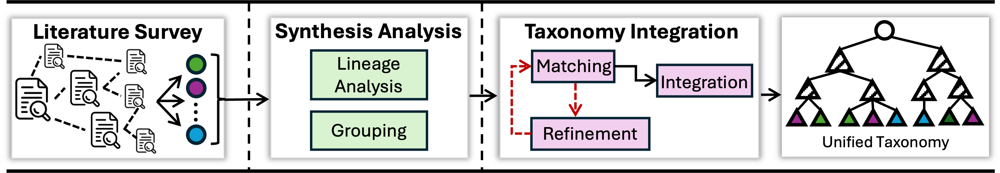
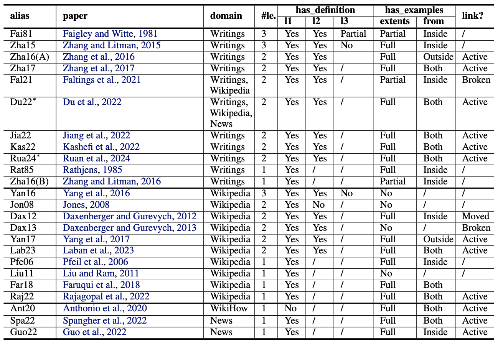
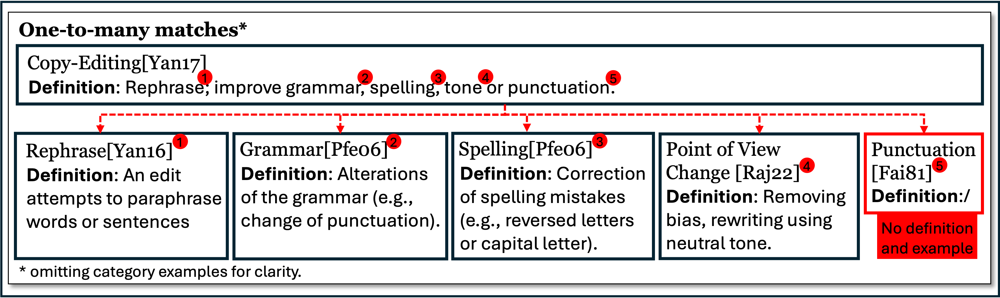
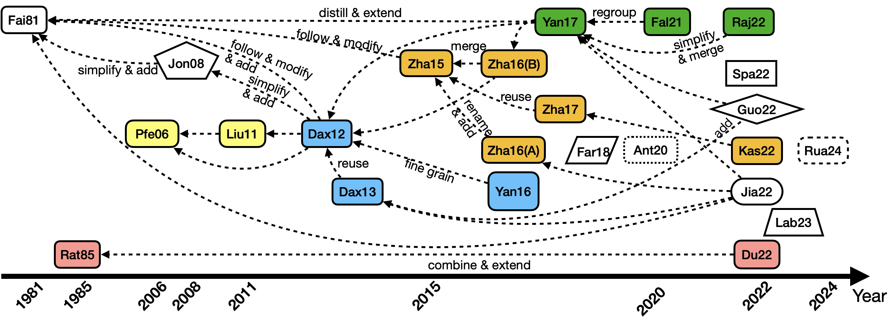
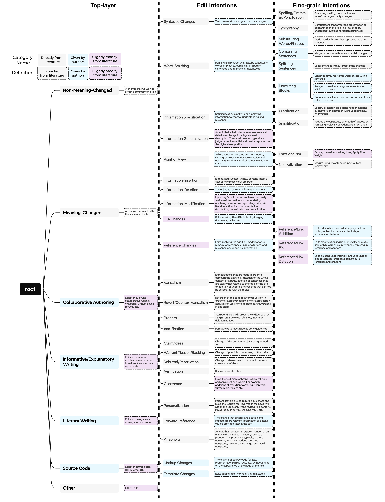

# UniT: One Document, Many Revisions, Too Many Edit Intention Taxonomies

## Overview
Writing is inherently iterative, each revision enhancing information representation. Examination of the intentions behind edits provides valuable insights. Current research on edit intentions lacks a comprehensive edit intention taxonomy (EIT) that spans multiple application domains. We develop a comprehensive EIT, **UniT**, that spans multiple application domains and encompasses all observed edit intentions, reducing the burden to create a new EIT for each application.

### Contributions

The contributions of this paper are as follows:
- We study 24 EITs and analyze their properties, such as structure, definitions, and revision examples. We also collect external resources, i.e., codes and datasets, and report on their reproducibility.
- We study the lineage relationship between EITs.
- We build an integrated EIT that spans multiple application domains and includes a large set of edit intentions.
- We compare our UNIT with existing EITs showing that that it achieves higher IAA scores and it is applicable to a larger set of application domains.

### Workflow


### Challenges
1. literature coverage to find all proposed EITs. The details can be found in [LiteratureReview.xlsx](./LiteratureReview.xlsx).


2. Integration procedure
    - Analyze and find lineage relationships between EITs, see [Lineage Relationship](#lineage-relationship)
    - Grouping
        - Reuse-based Grouping
        - Merge-based Grouping
        - Category Refinement Grouping
3. Edit intention matching


4. Coping with conflict resolution and missing information

## Lineage Relationship



## Resources

### UniT 



The visualization of complete UniT including revision examples can be found in [UniT-visualization.pdf](./UniT-visualization.pdf). You can also use [taxonomy-map-examples-paper-version.xmind](./taxonomy-map-examples-paper-version.xmind) file with [XminD](https://xmind.app/) app to check. 

### Matching and Integration

The detail of matching and integration can be found in [UniT_EIT_integration.xlsx](./UniT_EIT_integration.xlsx).

### The annotated datasets

- Annotated training datasets
    - `./annotations/training/`
- Annotated evaluation datasets
    - `./annotations/3annotators/`

- Code for sampling dataset
```bash
cd datasets/sampling
python sampling.py
```

### Annotation Instruction and Interface

See [annotation_instructions_examples.pdf](./annotation_instructions_examples.pdf) and [annotation_interface.pdf](./annotation_interface.pdf)

## Citation

```

```